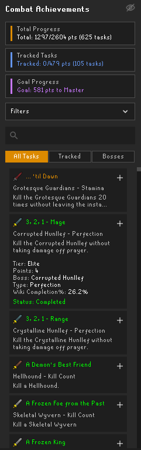
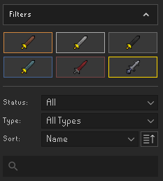

# Combat Achievements Tracker

A RuneLite plugin for tracking and managing Old School RuneScape Combat Achievements with advanced filtering, sorting, and progress tracking capabilities.

## Features

### Progress Tracking
- **Real-time Statistics**: View your total completion progress, tracked tasks, and goal progress
- **Tier-based Goals**: Set automatic or manual tier goals (Easy through Grandmaster)
- **Points Tracking**: Monitor points earned and remaining for your current goal
- **Expand**: Left-click on any task to expand it for more info

### Task Management
- **Track Important Tasks**: Mark achievements you're actively working on
- **Multiple Views**: Switch between All Tasks, Tracked Tasks, and Boss-specific views
- **Quick Actions**: Right-click for wiki links and to find more info on a task

### Boss Overview
- **Boss Grid View**: Visual overview of completion status for all bosses
- **Progress Indicators**: See at-a-glance completion rates for each boss
- **Boss-Specific Tasks**: Click any boss to view their specific achievements

### Advanced Filtering
- **Tier Filtering**: Toggle visibility for specific achievement tiers
- **Status Filtering**: Show completed, incomplete, or all achievements
- **Type Filtering**: Filter by achievement type (Kill Count, Perfection, Mechanical, etc.)
- **Search Functionality**: Find achievements by name or description

### Small Client Settings
- **Config**: Go to the plugin settings and turn on "Prefer Smaller Stats Panel"

## Usage

### Getting Started
1. Log into your OSRS account with RuneLite
2. Click the Combat Achievements Tracker icon in the sidebar
3. Your achievements will automatically load from your account on login

### Tracking Achievements
- Click the `+` button next to any achievement to track it
- Click the `-` button to remove it from tracking
- Use the "Tracked" tab to view only your tracked achievements

### Setting Goals
1. Configure your tier goal in the plugin settings
2. Choose "Auto" for automatic progression
3. Monitor your progress in the statistics panel

### Using Filters
1. Click "Tiers" to expand tier toggle buttons
2. Click "Filters" to access dropdown filters
3. Use the search bar to find specific achievements and bosses
4. Combine multiple filters for precise results

## Configuration

Access plugin settings through RuneLite's configuration panel:

- **Tier Goal**: Set your current achievement goal
- **Notifications**: Toggle completion notifications
- **Chat Messages**: Enable/disable progress messages in chat
- **Small client**: Enable/disable small client mode

## Features Overview

| Feature | Description |
|---------|-------------|
| **Live Data Loading** | Automatically syncs with your in-game progress |
| **Persistent Tracking** | Tracked achievements saved between sessions |
| **Boss Categorization** | Organized by boss for easy navigation |
| **Tier Progression** | Visual progress tracking through all tiers |
| **Search & Filter** | Find achievements quickly with multiple filter options |
| **Wiki Integration** | Right-click any achievement for wiki link |

